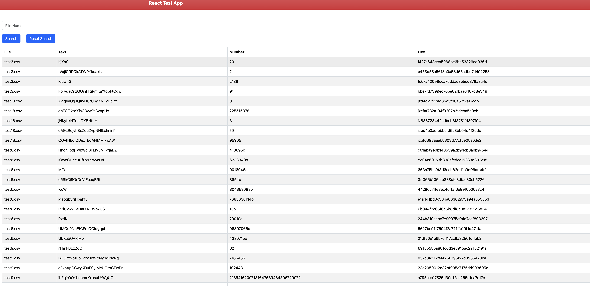

# File viewer test

This projects fetches files from an external API, filters and formats them to provide a standard response.

Is it divided in backend and frontend.

Backend: fetches files from external API and formats them in a standard response.
Frontend: Receives and Query data from backend to show the files in a table.

## Table of Contents

- [File viewer test](#file-viewer-test)
  - [Table of Contents](#table-of-contents)
  - [Prerequisites](#prerequisites)
  - [Installation](#installation)
  - [Usage](#usage)
    - [Frontend](#frontend)
    - [Backend](#backend)
      - [File Data API Documentation](#file-data-api-documentation)
      - [Endpoint Details](#endpoint-details)
      - [Query Parameters](#query-parameters)
      - [Response Codes](#response-codes)
      - [Example - 200 OK](#example---200-ok)
        - [Request](#request)
        - [Response](#response)
      - [Example - 200 OK Specific Filename](#example---200-ok-specific-filename)
        - [Request](#request-1)
        - [Response](#response-1)
      - [Example - 200 OK No file found](#example---200-ok-no-file-found)
        - [Request](#request-2)
        - [Response](#response-2)
  - [Tests](#tests)
    - [Backend](#backend-1)
    - [Frontend](#frontend-1)
  - [Troubleshoots](#troubleshoots)
    - [The app is not starting up.](#the-app-is-not-starting-up)

## Prerequisites

Before you begin, ensure you have met the following requirements:

- **Node.js:** This project requires Node.js. If you don't have it installed, you can download it from. Version: 16.20 [nodejs.org](https://nodejs.org/). Dont have node instaled or a different version? Try [nvm](https://github.com/nvm-sh/nvm)
- **Docker:** It is recommended to run this project using docker container. [docker official site](https://www.docker.com/).

## Installation

To install the project and its dependencies, follow these steps:

1. Clone the repository:

   ```bash
   git clone https://github.com/Ap1402/file-viewer-test
   ```

2. Go the project main folder:

   ```bash
   cd file-viewer-test

   ```

3. If you have docker run:

   ```bash
   docker-compose up --build
   ```

   3.a If you don't want to use docker, you are going to need to start every app manually:

   Front:

   ```bash
   cd front
   ```

   ```bash
   npm install
   ```

   ```bash
   npm run start
   ```

   Back:

   ```bash
   cd back
   ```

   ```bash
   npm install
   ```

   ```bash
   npm run start
   ```

## Usage

### Frontend

You can access to the application at http://localhost:3000/

It should show you a screen like this



Use the input above the table to filter files by filename.

You can enter the filename with the extension .csv or without it.

If the extension is missing in the input value, it is added under the hood.

### Backend

#### File Data API Documentation

This API endpoint allows you to retrieve data from CSV files. It is accessible at `localhost:3005/api/files/data`.

#### Endpoint Details

- **URL:** `localhost:3005/api/files/data`
- **Method:** GET

#### Query Parameters

- `fileName` (optional): The name of the CSV file you want to retrieve data from.

#### Response Codes

- `200 OK`: Successful request. Data is returned.
- `500 Internal Server Error`: An error occurred while processing the request.

#### Example - 200 OK

##### Request

GET localhost:3005/api/files/data

##### Response

```json
[
  {
    "file": "test2.csv",
    "lines": [
      {
        "text": "cGsggbPtRtJlFQJVjbcfEYYpZIPZr",
        "number": "00629280680433254943990968662540",
        "hex": "9b6031257d716ac8acbb3d1c6d804d60"
      }
    ]
  },
  {
    "file": "test3.csv",
    "lines": [
      {
        "text": "EmheluYvtcCiVWYbRYqJfedpm",
        "number": "7",
        "hex": "0826511bf4ddb55e7aad7b004cd660e0"
      }
    ]
  }
]
```

#### Example - 200 OK Specific Filename

##### Request

GET localhost:3005/api/files/data?fileName=test2.csv

##### Response

```json
[
  {
    "file": "test2.csv",
    "lines": [
      {
        "text": "cGsggbPtRtJlFQJVjbcfEYYpZIPZr",
        "number": "00629280680433254943990968662540",
        "hex": "9b6031257d716ac8acbb3d1c6d804d60"
      }
    ]
  }
]
```

#### Example - 200 OK No file found

##### Request

GET localhost:3005/api/files/data?fileName=nofile.csv

##### Response

```json
[]
```

## Tests

### Backend

First, check if you are in the "back" folder. If not, run

```bash
cd back
```

You can run tests by using the comman below. This will also run standard style checking before running the actual tests, so you should fix those issues before running any tests.

```bash
npm run tests
```

If you want to disable the standard check before runnning tests.

1. Go to package.json
2. Disable change this line

```
"test": "standard && mocha"
```

to:

```
"test": "mocha"
```

### Frontend

Not implemented.

## Troubleshoots

### The app is not starting up.

Usually, this means some of the ports are being used.
Check if these ports are being used:

- 3005
- 3000
